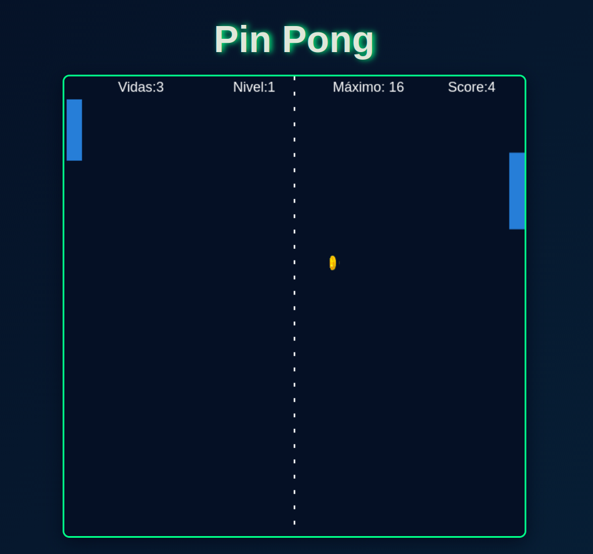
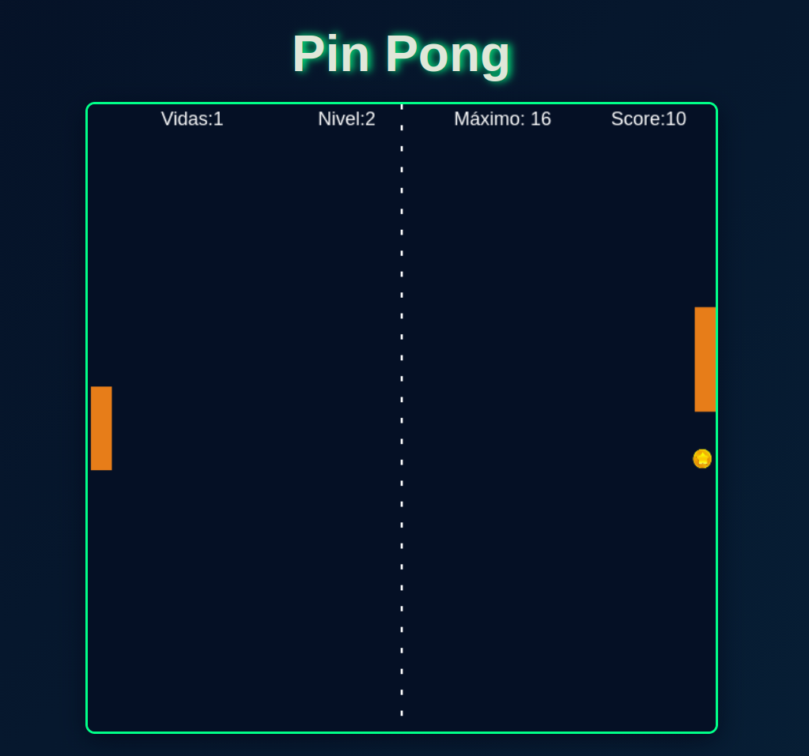

# juego_pin_pong
Juego usando Canvas 
Un juego de Pin Pong implementado en canvas con lógica en JavaScript.
El juego consiste en simular el juego clasico de pin pong donde un jugador controla en este caso una barra (lado izquierdo) 
del canvas para “golpear” una pelota que rebota continuamente en la pantalla.El objetivo es evitar que la pelota llegue al 
borde izquierdo y acumular puntos al hacer que toque el borde derecho y alcanzar el puntaje máximo sin perder todas las vidas.

El juego incluye barras(simulan las paletas que golpean) estas se podrán mover con las flechas del teclado (flecha arriba y 
flecha abajo), una pelota(semulada en forma de moneda de estrella que rota), puntaje y niveles de juego dende aumentrará la velocidad
y cambiaran de colores las barras, vidas y sonidos interactivos(como son rebote de pelota  con la barra, sondo al perder y sonido al ganar).

